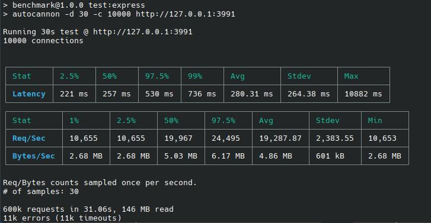
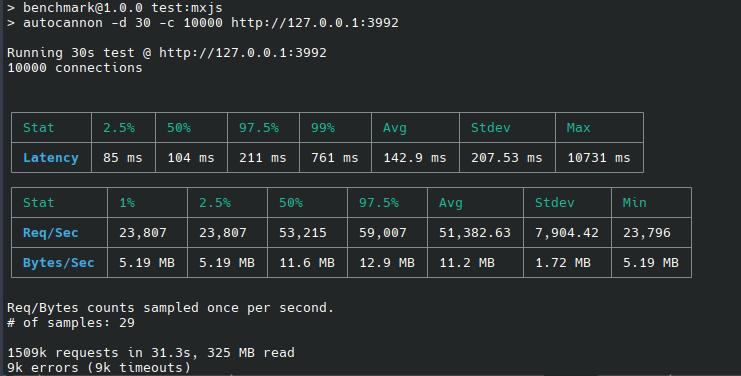
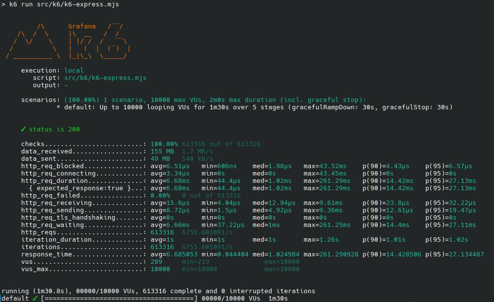
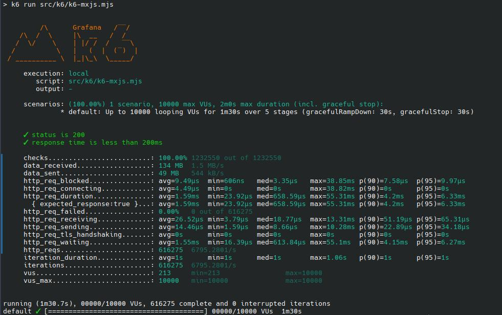

# Benchmarking results

This benchmarks were generate through some popular tools and using the same test input for each of the candidates.

### Autocannon

**Express.js**



**MxJs**



### K6

**Express.js**



**MxJs**



### WRK

**Express.js**

[wrk-express.txt](./wrk-express.txt)

```txt
Running 1m test @ http://127.0.0.1:3991
  8 threads and 2500 connections
  Thread Stats   Avg      Stdev     Max   +/- Stdev
    Latency    76.14ms   22.01ms   1.95s    82.97%
    Req/Sec     2.35k   811.17     6.88k    79.17%
  1122338 requests in 1.00m, 269.73MB read
  Socket errors: connect 0, read 540, write 0, timeout 779
Requests/sec:  18690.71
Transfer/sec:      4.49MB
```

**MxJs**

[wrk-mxjs.txt](./wrk-mxjs.txt)

```txt
Running 1m test @ http://127.0.0.1:3992
  8 threads and 2500 connections
  Thread Stats   Avg      Stdev     Max   +/- Stdev
    Latency    28.10ms   36.31ms   1.99s    99.65%
    Req/Sec     9.34k     2.30k   23.67k    76.36%
  4455066 requests in 1.00m, 0.90GB read
  Socket errors: connect 0, read 105, write 0, timeout 1791
Requests/sec:  74143.90
Transfer/sec:     15.41MB

```

Thanks,
~/@mahabubx7
